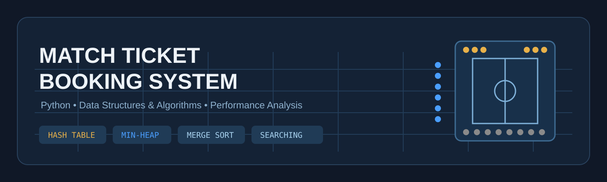
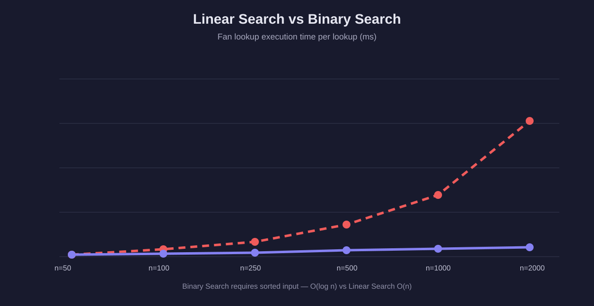
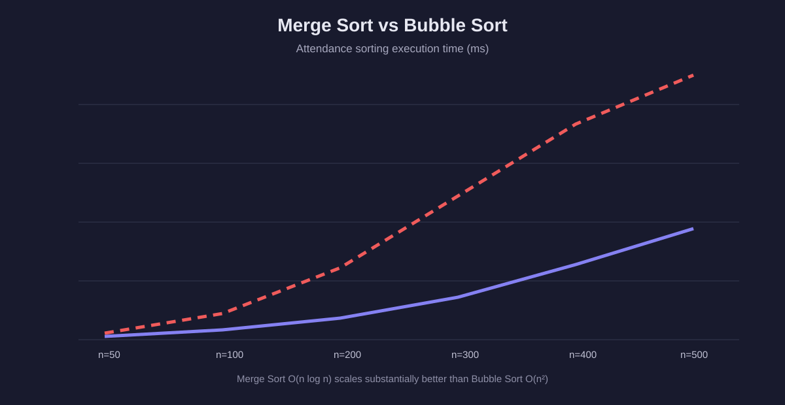

# Match Ticket Booking System

<div align="center">



</div>

A **Python Data Structures & Algorithms** project that models high-demand football ticket booking and evaluates how algorithmic choices affect lookup, sorting, queue processing, and booking performance.

> **Course:** EE367 — Data Structures & Algorithms  
> **Institution:** King Abdulaziz University  
> **Department:** Electrical & Computer Engineering

## Why this project exists

A ticket release can create many users competing for a limited number of seats. The project treats that as an algorithmic systems problem: choose appropriate data structures, implement the operations manually, build a baseline, then measure the difference.

The public repository is intentionally organized around the **Python/DSA core** so the important implementations are easy to inspect and run without depending on a GUI framework.

## Core implementation

| Problem | Implementation | Complexity |
|---|---|---:|
| Fan ID lookup | Custom Hash Table + separate chaining | O(1) average |
| Priority booking | Binary Min-Heap | O(log n) push/pop |
| Seat representation | 2D Array | O(1) indexed access |
| Optimized sorting | Merge Sort | O(n log n) |
| Baseline sorting | Bubble Sort | O(n²) |
| Optimized searching | Binary Search | O(log n) |
| Baseline searching | Linear Search | O(n) |

## System model

The simulated stadium contains **392 seats**:

| Zone | Seats | Price Multiplier |
|---|---:|---:|
| VIP | 48 | ×4 |
| Premium / High | 144 | ×2 |
| General | 200 | ×1 |
| **Total** | **392** | — |

Users are classified into three booking tiers:

1. **VIP**
2. **High Attendance** — 70%+ attendance
3. **General**

The booking engine uses a Binary Min-Heap in optimized mode so requests are processed by tier and then arrival time.

## Standard vs Optimized

The project deliberately keeps a slower baseline so the algorithmic improvement can be measured:

```text
STANDARD
  Linear Search
  List-based priority scan
  Bubble Sort

              VS

OPTIMIZED
  Hash Table
  Binary Min-Heap
  Binary Search
  Merge Sort
```

This makes the project an experiment in **algorithm selection**, not only an implementation exercise.

## Performance results

### Search



### Sorting



The benchmark layer also compares Hash Search against Linear Search and reports speedup measurements.

## Operational KPIs

The booking engine tracks metrics that connect the data structures to application behavior:

- Average lookup time
- Average processing time
- Throughput
- Queue wait time
- Occupancy / seat assignment
- Booking success and rejection counts
- Revenue by ticket zone

## Architecture

```text
src/
├── main.py                 # executable DSA demonstration
└── modules/
    ├── booking_system.py   # application orchestration + benchmarks
    ├── hash_table.py       # custom hash table
    ├── priority_queue.py   # custom binary min-heap
    ├── seat_grid.py        # 2D seat array
    ├── searching.py        # linear / binary / hash search
    ├── sorting.py          # merge / bubble sort
    ├── models.py           # domain models
    ├── mock_database.py    # deterministic 100-user dataset
    ├── match_catalogue.py  # match fixtures
    └── user_store.py       # local JSON persistence
```

## Run

Requirements:

- Python 3.8+
- No third-party packages

From the project directory:

```bash
python src/main.py
```

The entry point performs a complete small booking flow and runs the benchmark suite so the DSA behavior can be inspected directly from the terminal.

## Example dataset

The mock database generates **100 deterministic users**:

- 35 VIP
- 40 high-attendance
- 25 general

Example IDs:

```text
VIP001
VIP002
HA001
HA005
GP001
GP010
```

## Project workflow

```text
Real-world ticketing problem
            ↓
Data structure selection
            ↓
Manual implementation
            ↓
Baseline algorithm
            ↓
Optimized algorithm
            ↓
Benchmarking
            ↓
KPI / performance analysis
```

## Academic context

This project was developed as an EE367 Data Structures & Algorithms project at King Abdulaziz University.

The original academic report/presentation are intentionally not published here because they contain student identification numbers. The source package used during development is preserved separately; this public repository contains the cleaned, portfolio-oriented Python/DSA implementation.

## Team

- Abdulaziz Alzahrani — GUI & Coding
- Abdullah Almutairi — Report Writing & Coding
- Abdulaziz Alqassab — Presentation & Coding
- Ali Almalki — GUI & Coding

## License

Academic project. No open-source license is currently declared.
